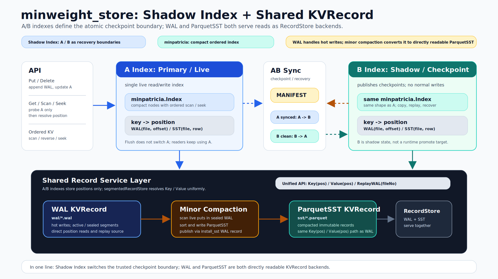

# minweight_store

`minweight_store` is a small single-node ordered KV store built around
[`minpatricia`](https://github.com/JimChengLin/minpatricia). It treats ordered
seek and scan as first-class operations, not as an afterthought on top of a
point-key store.

`New` creates an in-memory ordered KV store. `Open` creates the disk-backed
store with mmap WAL segments, shadow checkpoint indexes, and Parquet SST files.

## Quick View

### Architecture



The disk-backed store is intentionally small:

| Component | Role |
| --- | --- |
| Primary index | Live `minpatricia` index used by all reads, writes, seeks, and scans. |
| WAL segments | Fixed-size mmap record segments under `wal/*.wal`; new writes first land here. |
| Secondary index | Checkpoint index updated during flush/recovery; it is not on the read path. |
| Manifest | 1MiB append log that records the durable checkpoint boundary and live SST set. |
| SST files | Compacted records under `sst/*.parquet`; these are standard Parquet files and can be read by external Parquet tooling. |

The core idea is that runtime reads always use the primary index. Flush and
recovery synchronize a secondary checkpoint index without promoting or swapping
the live index.

### Design Highlights

- Ordered access is native: `SeekGE`, `SeekLE`, forward scan, reverse scan, and
  bounded range scan all come from the underlying ordered index.
- Disk SSTs are Parquet files. Compacted data is not trapped in a custom block
  format; offline tools can inspect `sst/*.parquet` directly.
- Flush is shadow-index based. It blocks writes while sealing/syncing WAL state,
  but readers continue to use the primary index.
- Recovery state is explicit. `MANIFEST`, WAL segments, primary index, secondary
  index, and SST file numbers have a small crash-state machine instead of a
  broad best-effort cleanup path.
- The implementation is designed to stay understandable: one live index, one
  checkpoint index, one shared file-number space for WAL and SST record
  segments.

### Benchmark Snapshot

The current `kvbench` pass compares `minweight_store` with pure-Go embedded KV
engines on an Apple M1 Pro using 4 Go threads. The full report is in
[kvbench/report.md](kvbench/report.md).

Default 9-byte key / 256-byte value load of 100k keys:

| Engine | Time | Throughput | Entries/s |
| --- | ---: | ---: | ---: |
| minweight | 50.7ms | 505.30 MB/s | 1,973,840 |
| pebble | 226.0ms | 113.29 MB/s | 442,540 |
| buntdb | 548.8ms | 46.65 MB/s | 182,227 |
| badger | 604.6ms | 42.34 MB/s | 165,396 |
| goleveldb | 884.0ms | 28.96 MB/s | 113,126 |
| bbolt | 4.34s | 5.90 MB/s | 23,032 |

Default 100k-key steady-state operations:

| Workload | minweight | badger | bbolt | buntdb | goleveldb | pebble |
| --- | ---: | ---: | ---: | ---: | ---: | ---: |
| Overwrite | 765.9ns/op | 7.301us/op | 41.310us/op | 5.767us/op | 7.861us/op | 2.238us/op |
| Get | 167.3ns/op | 1.225us/op | 698.1ns/op | 257.9ns/op | 1.173us/op | 6.564us/op |
| Mixed 90R/10W | 419.1ns/op | 2.379us/op | 4.833us/op | 907.5ns/op | 2.516us/op | 8.860us/op |
| SeekGE | 246.0ns/op | 47.397us/op | 753.6ns/op | 323.3ns/op | 4.017us/op | 7.447us/op |
| Scan 100k | 11.6ms | 36.6ms | 1.39ms | 9.53ms | 23.6ms | 21.0ms |

Large load with 6M entries and 2KiB values, writing 12.29GB raw value data:

| Engine | Time | Throughput | Entries/s | Approx. directory increment |
| --- | ---: | ---: | ---: | ---: |
| minweight | 31.9s | 385.63 MB/s | 188,296 | 13.13GB |
| goleveldb | 191.4s | 64.21 MB/s | 31,354 | 8.59GB |
| badger | 193.9s | 63.37 MB/s | 30,940 | 15.46GB |
| pebble | 227.5s | 54.00 MB/s | 26,370 | 12.56GB |
| bbolt | 358.6s | 34.27 MB/s | 16,733 | 29.22GB |
| buntdb | 514.0s | 23.91 MB/s | 11,673 | 17.12GB |

Large point reads after loading the same 6M-entry / 2KiB-value dataset:

| Engine | Get latency | Read throughput | Wall time | Final data size |
| --- | ---: | ---: | ---: | ---: |
| minweight | 3.349us/op | 611.59 MB/s | 78.0s | 13.14GB |
| goleveldb | 5.921us/op | 345.90 MB/s | 407.0s | 12.52GB |
| pebble | 55.897us/op | 36.64 MB/s | 423.6s | 12.53GB |

These numbers are workload and machine specific. On macOS, RSS is reported but
not used as a hard memory limit because file-backed mmap pages are counted in
RSS. The benchmark report documents commands, resource limits, result tables,
and known harness limitations. Large scan is deferred in this pass because
rebuilding and scanning multi-GB stores on the laptop is too time-consuming.

### Basic API

```go
store := minweight_store.New()

_ = store.Put([]byte("alpha"), []byte("one"))
value, ok, err := store.Get([]byte("alpha"))
deleted, err := store.Delete([]byte("alpha"))
length, err := store.Len()

item, ok, err := store.SeekGE([]byte("a"))
item, ok, err = store.SeekLE([]byte("z"))

err = store.Scan(func(item minweight_store.Item) bool {
	return true
})
err = store.ScanRange([]byte("a"), []byte("z"), func(item minweight_store.Item) bool {
	return true
})
```

Range semantics:

- `ScanRange(greaterOrEqual, lessThan)` visits `[greaterOrEqual, lessThan)`.
- `ScanRange(greaterOrEqual, nil)` visits `[greaterOrEqual, +inf)`.
- `ReverseScanRange(lessOrEqual, greaterThan)` visits `(greaterThan, lessOrEqual]`.
- `ReverseScanRange(lessOrEqual, nil)` visits `(-inf, lessOrEqual]` in descending order.
- `SeekGE` returns the first item whose key is `>= pivot`.
- `SeekLE` returns the last item whose key is `<= pivot`.
- `Delete` on a missing key returns `(false, nil)`. In WAL-backed stores it does
  not write a delete record for that miss.

## Detailed Design

The disk-backed implementation currently builds on Darwin and Linux.

```go
store, err := minweight_store.Open("db", minweight_store.Options{
	WALSize: 128 << 20,
})
if err != nil {
	return err
}
defer store.Close()
```

`Open` uses segmented fixed-size mmap WAL files as the record store. Index
positions are 63-bit record handles: high 33 bits are record file number, low
30 bits are offset or row inside that file. The file suffix determines the
record-store kind; current Store positions point to WAL segments under
`wal/*.wal` or compacted Parquet segments under `sst/*.parquet`.

`Flush` seals the active WAL, creates a new active WAL, syncs the new active WAL
header and WAL directory state, syncs the live primary index and sealed WAL,
writes `MANIFEST` with `primary_wal_flushed=true`, replays the sealed WAL into
the secondary checkpoint index, syncs and closes the secondary index, deletes
pending source WALs made obsolete by `install_sst`, fsyncs `wal/`, then writes
`MANIFEST` again with `primary_wal_flushed=false`. The live primary index is not
switched during flush.

`MANIFEST` stores `version`, `record_size`, `checkpoint_wal_file_no`,
`active_wal_file_no`, `next_file_no`, `wal_segment_size`,
`primary_wal_flushed`, live SST file numbers with total/deleted entry counts,
`seq`, and a CRC. It is a 1MiB variable-size log; normal commits append and
fsync the manifest file, and replacement is only used when the log is full.
On startup, a
legal manifest with `primary_wal_flushed=false` and an empty WAL tail lets
`Open` use the primary runtime index directly: no secondary copy, no replay, and
no startup flush. If the tail is non-empty, `Open` copies the secondary
checkpoint index into the primary runtime index, replays the active WAL segment
after the checkpoint, then checkpoints that recovered state. If
`primary_wal_flushed=true`, `Open` requires an empty active WAL, trusts the
synced primary index, copies primary to secondary, and clears the flag. If
`Options.WALSize` is unset, `Open` uses manifest `wal_segment_size` for future
WAL segments; an explicit `Options.WALSize` overrides it. Existing WAL segment
files are opened at their actual file size.
With a legal manifest, startup also removes valid `sst/*.parquet.tmp` files and
uncommitted Parquet files at or above the manifest `next_file_no`, except for
Parquet files that dirty WAL replay already installed and opened.
Default options use a 128MiB WAL segment, `WALReplayPointInTime`,
`VerifyIndexOnRead=false`, `MinorCompactionThreadNum=1`,
`MajorCompactionThreadNum=1`, `MaxImmutableWALNum=1`, `TargetSSTSize=512MiB`,
and `MaxGarbageRatioPerSST=0.2`.
Disk stores append structured `log/slog` text logs to `db/LOG` by default.
Pass `Options.Logger` to route those events to a caller-owned logger instead.
The default `db/LOG` file rotates before a write would cross 64MiB, renames old
files to `LOG.YYYYMMDD-HHMMSS.ffffff.<pid>`, and keeps the newest 8 archives.
Logged events are intentionally low-frequency: open/recovery, flush/checkpoint,
WAL-full flush triggers, minor compaction, major compaction, dispatcher errors,
and fatal store transitions. Ordinary point reads and writes do not log unless
they hit a WAL-full flush boundary.
Without a manifest, the WAL directory must be empty, contain only WAL segment
1, or contain WAL segment 1 followed by an empty segment 2 left by a crashed
rollover. Startup drops that empty segment and rebuilds/syncs the primary index
by replaying WAL segment 1. The no-manifest path is WAL-only; Parquet/SST state
belongs to the manifest-backed lifecycle.

`Close` is a no-op for durability when the active WAL is empty. Otherwise it
uses the same checkpoint path as flush: rollover, sync primary/sealed WAL/new
active WAL header, publish `primary_wal_flushed=true`, replay and sync
secondary, delete pending source WALs, then publish `primary_wal_flushed=false`.

Replay policies apply when rebuilding from WAL and when replaying WAL into the
secondary checkpoint index:

- `WALReplayStrict`: any corrupt WAL record fails `Open`.
- `WALReplayPointInTime`: replay the valid prefix and truncate WAL logical used
  to the first corrupt record.
- `WALReplayBestEffort`: repair the WAL before replay by keeping CRC-valid
  records and deleting corrupt bytes, then replay the repaired WAL strictly.

Minor compaction materializes checkpointed immutable WAL records into Parquet
segments. It considers WALs with `fileNo <= checkpoint_wal_file_no` while
keeping the newest `MaxImmutableWALNum` immutable WALs. For each source WAL, it
strictly replays records, sorts put candidates by key, filters each candidate by
probing the current index position, writes live records into Parquet, syncs and
installs that segment, appends an `install_sst` WAL record (`op=3`, payload is
source WAL file number plus Parquet file number), retargets primary index
entries from the source WAL file number to the new Parquet file number, and
schedules the source WAL for deletion. Delete-only WALs can compact to an empty
Parquet segment so the source WAL deletion still has a durable `install_sst`
record. Pending source WALs are deleted only after a later checkpoint has replayed
the `install_sst` into the secondary index, and before the final
`primary_wal_flushed=false` manifest commit.
Disk stores start a long-running minor compaction dispatcher and notify it on
startup and after flush. Each wake processes the full current eligible WAL list;
`MinorCompactionThreadNum` limits concurrent workers, not the number of WALs a
single signal can cover.

`MajorCompact` rewrites live Parquet SST segments into new Parquet segments. It
selects live SST file numbers whose manifest stats have
`deleted_entries / total_entries >= MaxGarbageRatioPerSST` (default `0.2`) and
drains the current eligible set in capped rounds. A round needs at least three
eligible SSTs in the normal path; if the final tail has fewer than three
eligible SSTs, it still runs when the overall live-SST garbage ratio reaches the
same threshold.
Each round uses at most `MajorCompactionThreadNum * 3` input SSTs and at most one
worker per three input SSTs, merge-sorts their keys, keeps only entries whose
current primary index position still points at the old SST position, writes
those entries into new SSTs near `TargetSSTSize`, then appends an
`install_sst_batch` WAL record (`op=4`) with old and new SST file numbers.
The publish step marks new SSTs live, retargets primary index entries, and
schedules old SSTs for deletion. Old SST files are deleted only after checkpoint
replay applies the batch record to the secondary index and before the final
`primary_wal_flushed=false` manifest commit.
Disk stores also register a compactable-SST callback on the segmented record
store. When an SST first reaches the garbage-ratio threshold (or becomes fully
deleted/empty), the callback wakes a long-running major compaction dispatcher.
Like the minor dispatcher, each wake calls the compaction method once; the method
itself drains all currently eligible SSTs through capped rounds and only leaves a
small final tail when the overall live-SST garbage ratio is still below the
threshold.

## License

MIT. See [LICENSE](LICENSE).
